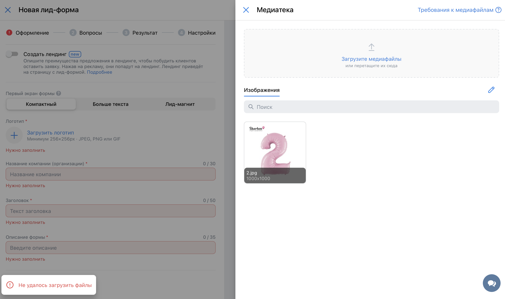

# Чек-лист
## Команда [SaraFun]
### Проект [ads.vk.com](https://ads.vk.com)

Тестируемые разделы:
1. [Создание лид-формы](#создание-лид-формы)

---

### [Создание лид-формы](https://ads.vk.com/hq/leadads/leadforms)
#### Авторизация требуется
1. Оформление:
    - При вводе названия длиннее 30 символов отображается ошибка: "Сократите текст"
    - При вводе заголовка длиннее 50 символов отображается ошибка: "Сократите текст"
    - При вводе описания формы длиннее 35 символов отображается ошибка: "Сократите текст"
    - 
    - При вводе пустого поля отображается ошибка: "Нужно заполнить"
    - 
    - При загрузки файла недопустимого формата (например, `.txt`) отображается ошибка: "Не удалось загрузить файлы"
    - 
    - При получении ошибки на следующий этап перейти нельзя
    - При успешной загрузки логотипа, он появляется в карточке, его можно изменить
    - 
    - При выборе стиля карточки она изменяется в соответвующий цвет
    - При смене с мобильной на десктопную версию превью меняется под соответсвующий формат

2. Вопросы:
    - При изменении последовательности полей карточки они меняются соответсвующим образом на превью
    - При удалении поля карточки оно не отображается на превью
    - При достижении максимального количества доступных полей карточки кнопка "+добавить контактные данные" не отображается    
    - 
    - При удалении поля после достижения максимального количества доступных полей кнопка "+добавить контактные данные" отображается
    - 

3. Результат:
   - При вводе пустого значения в поле "Заголовок" нельзя перейти на следующий этап и отображается ошибка: "Нужно заполнить"
   - При вводе пустого значения в поле "Описание" можно перейти на следующий этап, ошибка не отображается
   - При вводе некорректной ссылки на сайт нельзя перейти на следующий этап и отображается ошибка: "Невалидный url"
   - 
   - При вводе некорректного номера телефона нельзя перейти на следующий этап и отображается ошибка: "Телефон должен начинаться с + и содержать только цифры"
   - 
   - При вводе слишком длинного заголовка или описания нельзя перейти на следующий этап и отображается ошибка: "Сократите текст".
   - При вводе ссылки на сайт не протоколом http(s) нельзя перейти на следующий этап и отображается ошибка: "Необходимо указать протокол http(s)"
   - 
   - При не заполнении полей "Описание", "Ссылка на сайт", "Телефон для заказов" и "Промокод" они не отображается
   - 

4. Настройки:
   - При вводе слишком длинного ИНН нельзя перейти на следующий этап и отображается ошибка: "Сократите текст".
   - При вводе в ИНН букв не появляется ошибка и можно перейти на следующий этап
   - 
   - При вводе некорректной электронной почты нельзя перейти на следующий этап и появляется ошибка: "Некорректный email адрес"
   - 
   - При вводе пустого значения в поля "Фамилия, имя и отчество", "Адрес регистрации по месту жительства", "Email" и "ИНН" нельзя перейти на следующий этап и отображается ошибка: "Нужно заполнить"

5. Главная страница:
   - Есть возможность редактировать, архивировать и дублировать созданную лид-форму
   - При наведении на созданную лид-форму видно, что с ней можно сделать, когда была создана и сколько лидов
   - 
   - Есть возможность отправлять тестовую лид-форму
   - 
   - Есть возможность создать новую, посмотреть активные и архивные уже созданные лид-формы
   - 
